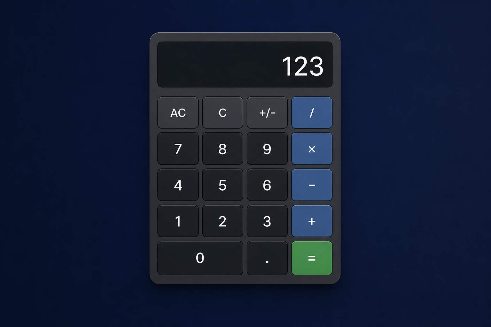

# Basic Calculator

A vanilla HTML/CSS/JavaScript calculator built from the [florinpop app-ideas spec](https://github.com/florinpop17/app-ideas/blob/master/Projects/1-Beginner/Calculator-App.md). Implements core arithmetic without `eval()`, with separated logic/UI layers and keyboard support.

**[Live demo](https://jkbitcraft.github.io/Basic-Calculator/)**



## About this project

This is **Project 1** in my [app-ideas](https://github.com/florinpop17/app-ideas) learning series — a personal portfolio path where I work through beginner projects to build fundamentals from the ground up.

It is my **first standalone project** built outside of university coursework. No tutors, no group briefs, no step-by-step handouts — just me, a spec, and the goal of understanding how a real app fits together. I used **AI as a teacher** throughout: it broke the work into lessons (scaffold → logic → operators → polish → deploy), explained concepts like state and event handling, and paused at each commit so I could learn the process, not just copy code.

I chose to start here because a calculator is small enough to finish, but rich enough to practice HTML structure, CSS layout, JavaScript state, and git workflow — the basics I wanted to learn properly before moving on to larger projects in the series.

## Features

- Basic operations: `+`, `-`, `/`, and `=`
- Chained calculations (e.g. `12 + 3 + 2 =`)
- 8-digit entry limit with `ERR` on overflow
- Divide-by-zero handling
- `AC` (clear all) and `C` (clear entry / undo last operator)
- Sign toggle (`+/-`) and decimals (up to 3 places)
- Full keyboard support
- Accessible display (`aria-live`) and semantic button markup

## Tech stack

- HTML5
- CSS3 (custom properties, Grid, responsive layout)
- Vanilla JavaScript (ES6+)
- GitHub Pages (hosting)

## Architecture

```
View       →  index.html, styles.css
Controller →  calculator.js (events → methods)
Model      →  calculator-logic.js (state + pure math)
```

`calculator-logic.js` has no DOM dependencies. Math helpers like `applyOperator()` are pure functions, which keeps behavior testable and easy to explain in interviews.

## Challenges & solutions

- **Chained operations** — Pressing a second operator computes the pending operation first, so `12 + 3 +` correctly shows `15` before waiting for the next number.
- **C vs AC** — Tracking `lastAction` lets `C` either clear the current entry or undo a pending operator, matching real calculator behavior.
- **Decimal precision** — Results format to the maximum decimal places entered in either operand, per the spec bonus requirement.
- **No `eval()`** — Explicit operator functions avoid security risks and keep calculation rules under full control.

## Run locally

No build step required.

```bash
npx serve .
```

Open `http://localhost:3000`, or open `index.html` directly in a browser.

## Deploy (GitHub Pages)

1. Push `main` to GitHub
2. Repo **Settings** → **Pages**
3. **Source:** Deploy from branch `main`, folder `/ (root)`
4. Live URL: `https://jkbitcraft.github.io/Basic-Calculator/`

## Project structure

```
Basic-Calculator/
├── index.html
├── styles.css
├── calculator-logic.js
├── calculator.js
├── docs/
│   └── screenshot.png
└── README.md
```

## Spec checklist

- [x] Display shows current number entered
- [x] Entry pad with digits 0-9 and operator buttons
- [x] Enter numbers up to 8 digits (extra digits ignored)
- [x] Operations (+, -, /, =)
- [x] AC clears all and sets display to 0
- [x] C clears last number or last operation
- [x] ERR when result exceeds 8 digits
- [x] Bonus: +/- toggle
- [x] Bonus: decimal point (3 places)

## Learning journey

Built incrementally in lessons with AI guidance: scaffold → digit input → operators → clear/ERR → bonus features → deploy. Each step was a separate commit so the history shows how the project grew piece by piece.

This is the first entry in the series. Future projects from [app-ideas](https://github.com/florinpop17/app-ideas) will be added to my portfolio as I work through them.

## Future improvements

- `%` modulo operator
- Calculation history tape
- Light/dark theme toggle
- Unit tests (Vitest) for `calculator-logic.js`
- Mobile haptic feedback

## License

MIT
